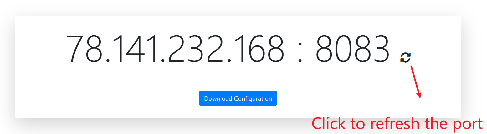

# wg-auto

Automatically generate new TCP/UDP ports for Wireguard if forbidden.



## Docker

```
$ docker run -d \
  --network host \
  -e WG_PASSWORD=🚨YOUR_ADMIN_PASSWORD \
  -v /var/run/docker.sock:/var/run/docker.sock \
  wuhanstudio/wg-auto
```

## Quick Start

```
$ docker pull weejewel/wg-easy
$ export WG_PASSWORD=YOUR_PASSWORD
$ npm install
$ node server.js

```

The website is available now at **http://localhost:3000**
